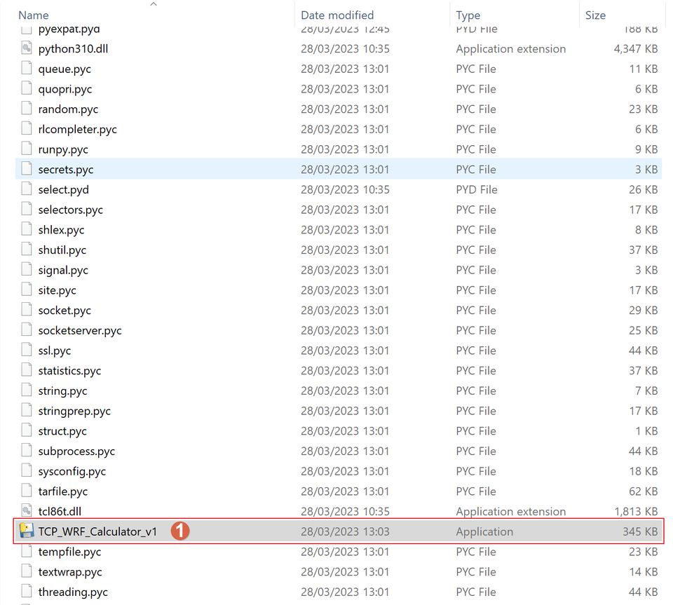
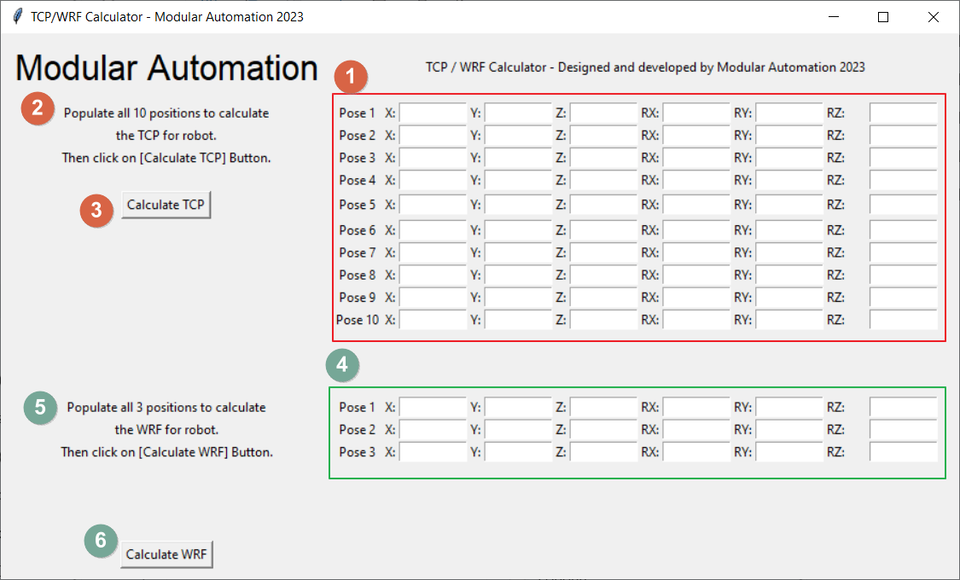

# About

Tool to allow engineers to easily calculate TCP and WRF for robots which this standard feature is not avaiable. The following tool can be used on the HMI application or stand alone. 

==NOTE:== Meca are not mechanical calibrated robots. The TCP and WRF could differ from the calculated coordinates acquired using this application to the current robot mechanical TCP position.

# Application requirement

The minimal requirement to run the exe file:

- Windows 10

# Opening Application

Open explorer and find a file called: "TCP_WRF_Calculator_v*.*.*" (note that the version may vary) marked as [1].

# Application Overview
 
Application contains two main sections:

**A section highlighted in red**
Section for TCP Calculations – marked red and with numbers [1], [2], [3]

​​​​​​​**B section highlighted in green**
Section for WRF Calculations – marked green and with numbers [4], [5], [6]

